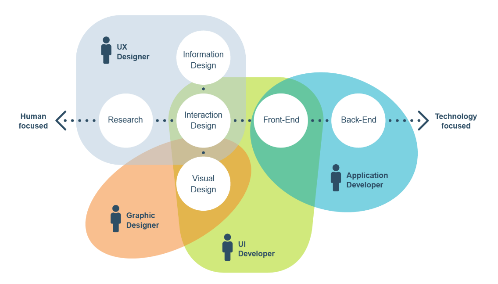

# Blok 1 — Cieľ webu

Vitaj na predmete Návrh a tvorba webových stránok! Skôr než na konci semestra postavíš vlastný web (áno, postavíš — s pomocou AI), musíš vedieť, **čo staviaš a pre koho**. Je to ako s domom: nikto nezačína tehlami, začína sa projektom. Prvých päť blokov je presne o tom — **navrhneš web**, ktorý si potom v druhej časti predmetu **sám vytvoríš a dáš na internet**.

V tomto bloku si vyberieš tému svojho webu a jasne pomenuješ jeho cieľ. Znie to jednoducho, ale je to najdôležitejšie rozhodnutie semestra — všetko ďalšie (persóny, štruktúra, prototyp aj hotový web) bude stáť na ňom.

!!! warning "Pravidlo časti 1: navrhuješ TY, nie AI"
    V tejto časti predmetu tvoríš všetky výstupy **sám** — cieľ, persóny, štruktúru aj prototypy. AI (ChatGPT, Copilot a pod.) smieš používať len ako **oponenta**: môže tvoju prácu kritizovať, klásť ti nepríjemné otázky a hľadať v nej diery. Nesmie ju tvoriť za teba. Prečo? Lebo v druhej časti predmetu bude AI stavať web presne podľa tvojho návrhu — a keď návrh nebude tvoj, nebudeš vedieť skontrolovať, či je výsledok správny.

## 🎯 Čo sa v tomto bloku naučíš

- Rozpoznať, čím sa líši dobrý web od zlého (a že to nie je náhoda, ale rozhodnutia).
- Čo je UX a UI a prečo návrh webu nie je „iba grafika".
- Vybrať si realistickú tému projektu na celý semester.
- Popísať cieľ webu cez **štyri kľúčové otázky**.

## Krok 1 — Rozcvička: dobrý vs. zlý web 🔍

Pracuj vo dvojici s kolegom. Každý z vás má **5 minút** na to, aby našiel:

1. jednu stránku, ktorá ťa **frustruje** (nedá sa na nej nič nájsť, vyskakujú okná, neprehľadný chaos),
2. jednu stránku, ktorá sa ti **dobre používa**.

Potom si ich navzájom ukážte. Pri každej povedz **konkrétne**, čo ťa hnevá alebo čo funguje — nie „je škaredá", ale „hľadal som otváracie hodiny a nenašiel som ich ani na tretí klik".

!!! note "Pointa rozcvičky"
    Frustrácia na webe má vždy konkrétnu príčinu — a tá príčina je vždy **niečie rozhodnutie** (alebo jeho absencia). Webdizajn je séria rozhodnutí: čo na stránke bude, kde to bude a prečo. Tento semester sa naučíš robiť ich vedome.

## Krok 2 — Čo je UX a UI 🧭

Návrh webu nie je len grafika a nie je to ani programovanie. Je to spektrum činností od **človeka** po **technológiu**:



- **UX (User Experience)** — ako sa web *používa*: výskum používateľov, štruktúra informácií, návrh interakcií. Tomu sa venujeme v tejto časti predmetu.
- **UI (User Interface)** — ako web *vyzerá*: vizuálny dizajn, farby, typografia.
- **Front-end / Back-end** — ako web *funguje* technicky. Toto za teba v časti 2 napíše AI.

Ako sa pozná, že je web dobre navrhnutý? Norma **ISO 9241** definuje *použiteľnosť* ako mieru, do akej vie konkrétny používateľ dosiahnuť svoj cieľ **účinne, efektívne a so spokojnosťou**. Všimni si: v strede definície je **používateľ a jeho cieľ** — nie vkus dizajnéra. Presne preto začíname cieľom a používateľmi, nie farbami.

## Krok 3 — Vyber si tému projektu 💡

Vyber si web, ktorý budeš **celý semester navrhovať a na konci semestra s AI aj reálne postavíš**. Preto musí byť rozsah realistický.

**Dobrá téma je:**

- web pre **malú firmu, službu alebo komunitu** — skutočnú (brigáda, rodinný podnik, oddiel) alebo fiktívnu,
- zvládnuteľná ako **jedna hlavná stránka + niekoľko sekcií či podstránok**,
- niečo, k čomu vieš povedať, **kto to bude používať a prečo**.

**Príklady:** kaviareň či bistro, kaderníctvo, autoservis, fitness tréner, fotograf, e-shop s jedným typom produktu (landing page), športový klub, študentský spolok, podujatie (festival, ples, konferencia), penzión.

**Čomu sa vyhni:** sociálna sieť, marketplace, aplikácia s registráciou používateľov, „nový Bolt". To sú systémy na roky vývoja — nie preto, že by si na to nemal, ale nedajú sa dokončiť za semester.

!!! example "Vzorový príklad: doručovacia spoločnosť"
    Celou časťou 1 ťa bude sprevádzať jeden vypracovaný príklad — **plánovacia aplikácia pre doručovaciu spoločnosť** (správa kuriérov a zásielok). Je zámerne *zložitejší* než tvoj projekt, aby na ňom bolo vidno všetky techniky. Tvoj web bude jednoduchší — a o to lepšie sa dá dotiahnuť. Popis cieľa príkladu: [ciel-priklad-dorucovanie.docx](subory/ciel-priklad-dorucovanie.docx)

## Krok 4 — Popíš cieľ: štyri otázky 🎯

Založ si dokument **„Návrh webu — [tvoja téma]"** (Word alebo Google Docs). Tento dokument bude rásť celý semester a v bloku 5 sa z neho stane zadanie pre AI. Ako prvé do neho napíš:

**Krátky odsek (3–5 viet):** čo web robí a komu slúži.

**Potom odpovedz na štyri otázky.** V praxi ti objednávateľ málokedy dá hotovú analýzu — na tieto otázky sa musí dizajnér **pýtať** (objednávateľa aj budúcich používateľov):

1. **Kto bude web používať?** Konkrétne skupiny ľudí, nie „všetci". (*Doručovacia spoločnosť: manažér prepravy v e-shope, dispečer, manažér doručovacej firmy.*)
2. **Aký problém používateľov web rieši?** Čo dnes robia zle, pomaly alebo vôbec? Skús pridať aj **KPI** — merateľný ukazovateľ, podľa ktorého sa dá overiť, že web pomáha (počet objednávok, rezervácií, telefonátov menej). (*Príklad: telefonovanie kuriérom je neefektívne, CRM systémy sú drahé a zložité.*)
3. **V čom si lepší ako konkurencia?** Pomenuj výhodu oproti existujúcim alternatívam — a áno, konkurenciu si musíš najskôr **pozrieť**. (*Príklad: rýchle a jednoduché používanie, podpora 24/7.*)
4. **Prečo web vzniká z pohľadu firmy?** Zisk, značka, úspora času? Táto otázka je menej dôležitá ako prvé tri, ale pomôže pri rozhodovaní. (*Príklad: najskôr MVP pre vlastnú potrebu, potom ponúknuť ďalším.*)

!!! tip "Píš konkrétne"
    „Web pre kaviareň, aby mala web" nie je cieľ. „Web, vďaka ktorému turisti v okolí nájdu kaviareň a rezervujú si stôl bez telefonovania" — to je cieľ, s ktorým sa dá pracovať. Konkrétny cieľ ti v ďalších blokoch rozhodne spory typu „má tam byť fotogaléria?" (má, ak pomáha cieľu).

## Krok 5 — Oponentúra: kolega a AI 🥊

Hotový cieľ musí prežiť kritiku. Sprav dve kolá:

**1. Kolega:** vymeňte si dokumenty s kolegom z dvojice. Prečítaj jeho cieľ a odpovedz mu na tri otázky: *Pochopil som z toho, čo web robí? Použil by som ho? Ktorá odpoveď na 4 otázky je najslabšia?*

**2. AI oponent:** vlož svoj text do AI chatu s týmto promptom:

```
Toto je cieľ webu, ktorý navrhujem, a odpovede na štyri otázky (kto, aký problém,
v čom lepší, prečo). Buď prísny oponent: polož mi 5 nepríjemných otázok, ktoré by
mi položil investor, a označ najslabšie miesto môjho zadania. Nenavrhuj vlastné
riešenia ani neprepisuj môj text — len sa pýtaj a kritizuj.
```

Odpovede na najlepšie otázky **zapracuj do dokumentu**. Ak niektorú otázku nevieš zodpovedať, práve si našiel dieru vo svojom zadaní — to je presne účel oponentúry.

## ✅ Skontroluj si výstup

Na konci bloku máš v dokumente „Návrh webu":

- [ ] Vybranú **tému** — malý web, ktorý sa dá za semester navrhnúť aj postaviť.
- [ ] Odsek o tom, **čo web robí a komu slúži**.
- [ ] Odpovede na **všetky štyri otázky** (kto / aký problém / v čom lepší / prečo).
- [ ] Aspoň **jedno KPI** — ako sa pozná, že web funguje.
- [ ] Zapracované pripomienky z oponentúry (kolega + AI).

## 📌 Zhrnutie

- Webdizajn je **rozhodovanie**, nie kreslenie — a rozhodnutia sa opierajú o cieľ.
- **UX** = ako sa web používa, **UI** = ako vyzerá; začíname vždy od UX.
- Použiteľnosť sa meria cez **používateľa a jeho cieľ** (ISO 9241), nie cez vkus.
- Cieľ webu = odsek + štyri otázky: **kto, aký problém, v čom lepší, prečo**.
- Máš tému, ktorú budeš rozvíjať celý semester — a na konci ju postavíš.

V ďalšom bloku sa pozrieš svojim používateľom do hlavy — vytvoríš **persóny**.

👉 Pokračuj na **[Blok 2 — Persóny](blok-2-persony.md)**
